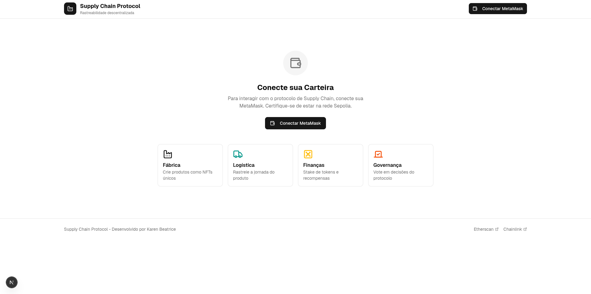

# 📦 Supply Chain Protocol — Web3 Traceability & Governance

Este repositório contém o MVP de um protocolo descentralizado para rastreabilidade de cadeias de suprimentos.  
O projeto utiliza tecnologia blockchain para garantir **transparência, imutabilidade e segurança** no registro de eventos logísticos, integrando NFTs, Staking e Governança Descentralizada (DAO).

---

## Visão Geral

O sistema gerencia o ciclo de vida de produtos através de contratos inteligentes modulares, permitindo que fabricantes, transportadoras e usuários interajam de forma auditável e descentralizada.

### Componentes Principais

- **NFT de Produtos (ERC-721):**  
  Cada item é representado como um ativo único que armazena sua jornada de forma imutável na blockchain.

- **Protocolo de Staking:**  
  Mecanismo de incentivo econômico que recompensa agentes logísticos pelo compromisso com o sistema.

- **Governança (DAO):**  
  Permite que participantes tomem decisões sobre o protocolo com base no saldo em staking.

- **Oráculos (Chainlink):**  
  Integração com dados externos para ajuste dinâmico de recompensas com base no preço do ETH.

---
<p align="center">
  
</p>

## Arquitetura Técnica

O projeto adota uma estrutura modular para garantir **separação de responsabilidades, segurança e escalabilidade**.

- **Smart Contracts:**  
  Desenvolvidos em Solidity utilizando padrões OpenZeppelin.

- **Frontend:**  
  Aplicação Web construída com **React** e **Next.js**.

- **Integração Web3:**  
  Comunicação com a blockchain utilizando **ethers.js** via MetaMask na rede Sepolia.

- **Auditoria de Segurança:**  
  Análise estática realizada com **Slither**.

---

## Funcionalidades do Frontend

A interface foi projetada para oferecer uma experiência fluida com atualização dinâmica de dados.

- **Fábrica:**  
  Interface para criação (*mint*) de novos produtos via NFT.

- **Logística:**  
  Registro de eventos e consulta do histórico de rastreabilidade.

- **Finanças:**  
  Dashboard de Staking com cálculo dinâmico de recompensas e resgate (*claim*).

- **Governança:**  
  Painel para criação e votação de propostas da DAO.

---

## 🔧 Configuração e Instalação

### Pré-requisitos

- Node.js (v18+)
- MetaMask instalada no navegador
- Tokens de teste na rede **Sepolia**

---

### Instalação

```bash
git clone https://github.com/karenbeat/SupplyChain.git
cd SupplyChain
npm install
npm run dev
